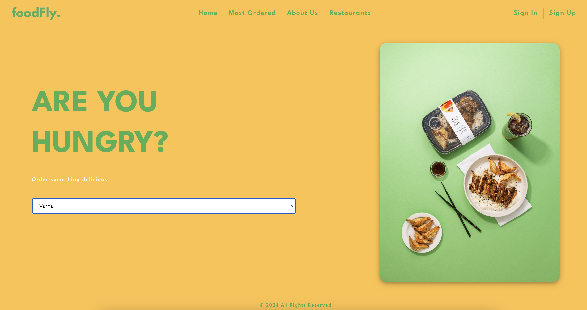
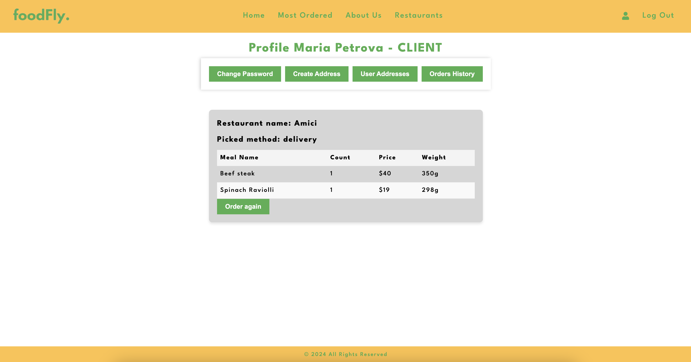
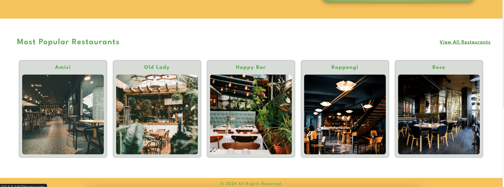
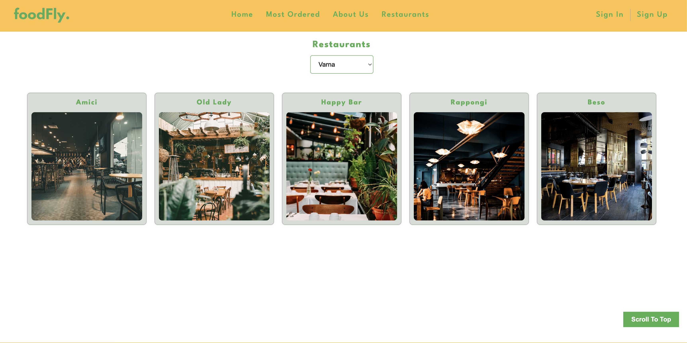
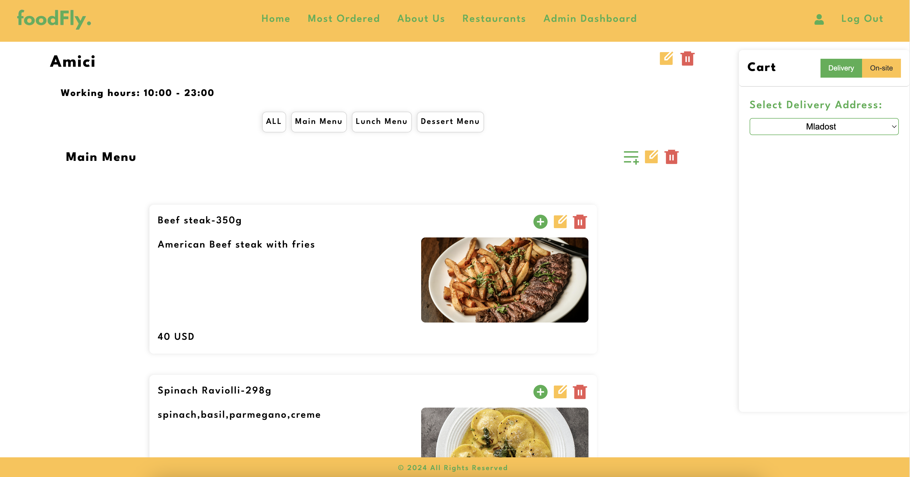
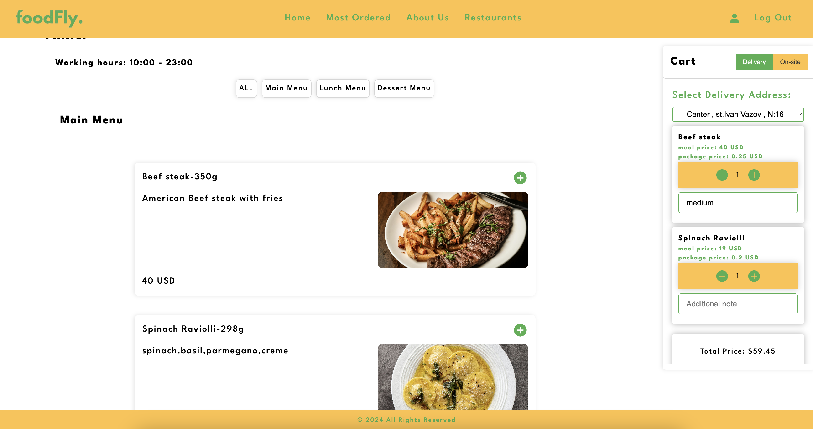
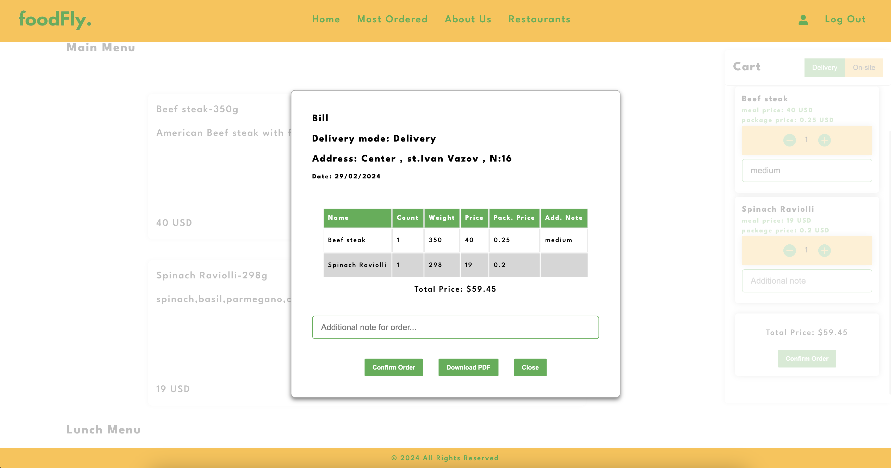
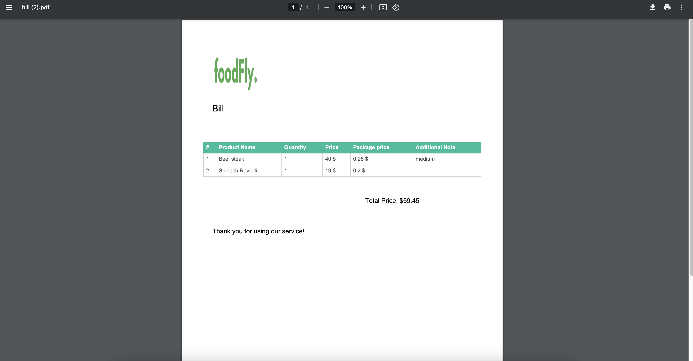
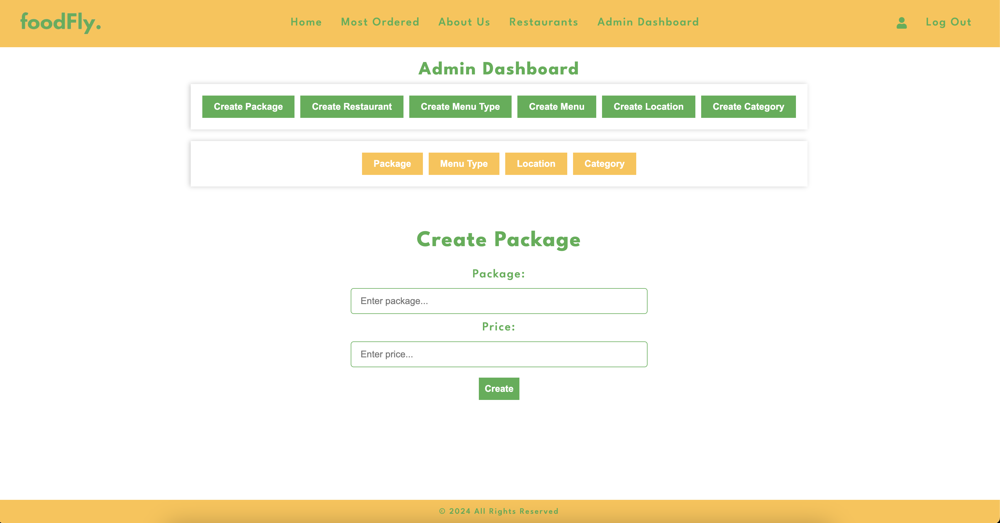

# Restaurant Management App

Our application is designed to provide an intuitive and user friendly interface for both - clients and administrators to manage food orders from various restaurants located all over the country.

## Getting Started
 
1. Clone the repository:
   https://github.com/DimitarMitev92/restaurant-front-end-react.git
 
2. Navigate to the repository:
   Go to the repository folder: cd restaurant-management-frontend
 
3. Install all the dependencies (we highly recommend using npm):
   npm install
 
4. Start the development server
   npm run dev
 
5. Open your browser and visit http://localhost:5173 /or different/
 
## Features
- **Users**:
  - ADMIN and CLIENT

- **Authentication**:
  - Users can log in and register with email, password, confirmation password, and location.
  
  - Not possible to order without registration.
  - Clients can see order history.
  

- **Restaurant Listing**:
  - View a list of restaurants with their menus and meals.
  

  - Can sort restaurant by location.
  

- **Menu Items**:
  - Each menu item has pictures, description, price, and weight.
  

- **Ordering**:
  - Users can create orders with one or more meals.
  - Choose between picking up or delivery.
  - Add delivery addresses.

- **Shopping Cart**:
  - Users can add selected meals to the basket and keep it on refresh.
  

  - Can decide to confirm or not the order.
  

  -Can download the bill.
  

- **Admin Module**:
  - Admins can add/update/remove packages, locations, menu types, categories, restaurants.
  

  - Set up menus and meals data.
  - Adjust menu/meal daytime availability and period expiration.

- **Additional Functionalities**:
  - Change password for both admin and client.
  - Allow clients to add notes to meals in the order, preview order, and download generated bill with order details.

- **Validation**:
  - Orders limited to restaurants in the user's location.
  
  - Minimum total sum for delivery orders.

- **Responsive Design**:
  - Fully responsive UI on various devices.

## Libraries
## Production Dependencies:
| Package                             | Version    |
|-------------------------------------|------------|
| `@nestjs/cli`                       | `10.0.0`   |
| `@nestjs/schematics`                | `10.0.0`   |
| `@nestjs/testing`                   | `10.0.0`   |
| `@types/express`                    | `4.17.21`  |
| `@types/jest`                       | `29.5.2`   |
| `@types/multer`                     | `1.4.11`   |
| `@types/node`                       | `20.3.1`   |
| `@types/supertest`                  | `6.0.0`    |
| `@typescript-eslint/eslint-plugin`  | `6.0.0`    |
| `@typescript-eslint/parser`         | `6.0.0`    |
| `eslint`                            | `8.42.0`   |
| `eslint-config-prettier`            | `9.0.0`    |
| `eslint-plugin-prettier`            | `5.0.0`    |
| `jest`                              | `29.5.0`   |
| `prettier`                          | `3.0.0`    |
| `source-map-support`                | `0.5.21`   |
| `supertest`                         | `6.3.3`    |
| `ts-jest`                           | `29.1.0`   |
| `ts-loader`                         | `9.4.3`    |
| `ts-node`                           | `10.9.1`   |
| `tsconfig-paths`                    | `4.2.0`    |
| `typescript`                        | `5.1.3`    |
| `@react-pdf/renderer`               | `3.3.8`    |
| `@tanstack/react-query`             | `5.20.2`   |
| `@tanstack/react-query-devtools`    | `5.20.3`   |
| `@types/react-router-dom`           | `5.3.3`    |
| `@types/yup`                        | `0.32.0`   |
| `formik`                            | `2.4.5`    |
| `i`                                 | `0.3.7`    |
| `jspdf`                             | `2.5.1`    |
| `jspdf-autotable`                   | `3.8.2`    |
| `jwt-decode`                        | `4.0.0`    |
| `npm`                               | `10.4.0`   |
| `react`                             | `18.2.0`   |
| `react-admin`                       | `4.16.11`  |
| `react-dom`                         | `18.2.0`   |
| `react-icons`                       | `5.0.1`    |
| `react-modal`                       | `3.16.1`   |
| `react-query`                       | `3.39.3`   |
| `react-router-dom`                  | `6.22.0`   |
| `react-spinners`                    | `0.13.8`   |
| `react-swipeable`                   | `7.0.1`    |
| `react-to-pdf`                      | `1.0.1`    |
| `react-to-print`                    | `2.15.1`   |
| `react-toastify`                    | `10.0.4`   |
| `styled-components`                 | `6.1.8`    |
| `yup`                               | `1.3.3`    |
 
## Development Dependencies:
| Package                           | Version   |
|-----------------------------------|-----------|
| `@types/jspdf`                    | `2.0.0`   |
| `@types/react`                    | `18.2.55` |
| `@types/react-dom`                | `18.2.19` |
| `@types/react-modal`              | `3.16.3`  |
| `@typescript-eslint/eslint-plugin`| `6.21.0`  |
| `@typescript-eslint/parser`       | `6.21.0`  |
| `@vitejs/plugin-react`            | `4.2.1`   |
| `eslint`                          | `8.56.0`  |
| `eslint-plugin-react-hooks`       | `4.6.0`   |
| `eslint-plugin-react-refresh`     | `0.4.5`   |
| `typescript`                      | `5.2.2`   |
| `vite`                            | `5.1.0`   |
 
## Endpoints
static folder - endpoints.ts
The file contains:
- Definitions for various API endpoints with placeholders for a PORT value.
- Definitions for different routes used in the application, including main routes, admin dashboard routes, user authentication routes, profile routes, and a catch-all route.
- Definitions for common HTTP methods like GET, POST, PATCH, and DELETE.
- Definitions for user rights roles such as ADMIN and CLIENT.
- A filter option.
- A header object for setting the Content-Type as application/json.

## Team Members
| Name              | GitHub                                 |
|-------------------|----------------------------------------|
| `Radina Georgieva`| `https://github.com/radinag94`         |
| `Ana Popova`      | `https://github.com/AniPopova`         |
| `Petar Georgiev`  | `https://github.com/PetarGeorgiev-hash`|
| `Dimitar Mitev`   | `https://github.com/DimitarMitev92`    |
 
## Contributing
If you'd like to contribute, please fork the repository and create a pull request. Feel free to contact any team member for collaboration.

## License
This project is licensed under the MIT License - see the LICENSE.md file for details.

